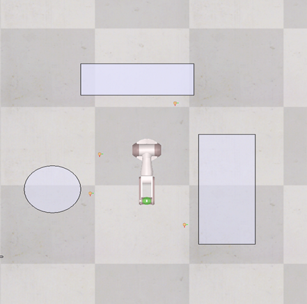
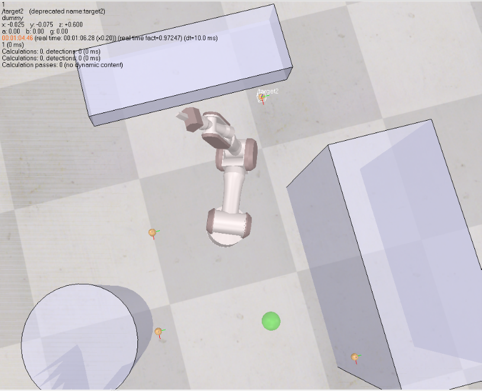
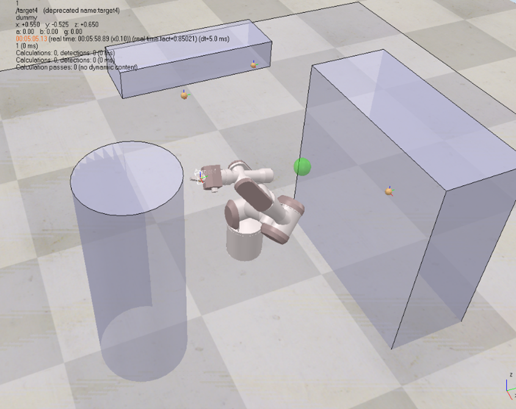

# 🤖 7-DOF Manipulator Motion Planning with OMPL

> 📚 **Academic Project** - Coursework for MSc Mechatronics module ME7028 (Advanced Robotics) at Kingston University, London

[](https://www.lua.org/)
[](https://www.coppeliarobotics.com/)
[](https://ompl.kavrakilab.org/)
[](LICENSE)

## 🎯 Project Overview

Autonomous motion planning for a **7-DOF redundant robotic manipulator** in CoppeliaSim. The system navigates the end-effector through **4 sequential target points** while avoiding **4 obstacles** including the floor plane.

## 🏗️ Approach: Hybrid Planning Strategy

The system integrates two complementary algorithms:

### 1️⃣ Inverse Kinematics (simIK)
- Samples feasible joint configurations
- Up to 1000 trials per target
- Validates against collision constraints
- Position-constrained IK solving

### 2️⃣ Motion Planning (OMPL)
- **Algorithm:** RRTConnect (Rapidly-exploring Random Tree)
- Plans collision-free paths between configurations
- Sampling-based approach for high-dimensional spaces
- Real-time path execution via stepping mode

## 📸 Visual Execution

### Initial Configuration

*7-DOF manipulator at simulation start with obstacles*

### Obstacle Avoidance

*Manipulator navigating around obstacles to reach target 2*

### Final Target

*Manipulator successfully reaching the final target position*

## ✨ Key Features

### 🛡️ Dual-Layer Collision Validation
- Configuration validation callback
- End-effector z-axis safety margin (above 1cm from ground)
- Group-based collision checking (robot vs obstacles)

### 🔄 Modular Pipeline
- **getConfig() / setConfig()** - State management
- **configurationValidationCallback()** - Safety checks
- **IK environment setup** - Cartesian-to-joint mapping
- **Trajectory playback** - Stepped simulation execution

### 🎯 Robust Target Achievement
- Cyclic navigation through 4 target points
- Maximum joint distance constraint (1.5 rad)
- Up to 1000 IK trials per target
- 6-second planning timeout per path

## 🛠️ Tech Stack

**Language:** Lua  
**Simulator:** CoppeliaSim EDU  
**Libraries:**
- `sim` - Core simulation interface
- `simIK` - Inverse kinematics solver
- `simOMPL` - OMPL motion planning library

**Algorithms:**
- RRTConnect (sampling-based planning)
- Position-constrained inverse kinematics
- Collision detection (broad and narrow phase)

## 📁 Repository Structure

```
├── scripts/
│   └── motion_planner.lua    Main Lua control script
├── docs/
│   └── motion_planning_report.pdf
├── demo/
│   └── images/
│       ├── 01_initial_config.png
│       ├── 02_obstacle_avoidance.png
│       └── 03_final_target.png
├── README.md
└── LICENSE
```

## 🚀 How to Run

### Prerequisites
- CoppeliaSim EDU (4.x or higher)
- simIK plugin enabled
- simOMPL plugin enabled

### Steps
1. Open CoppeliaSim
2. Load the scene with 7-DOF manipulator and obstacles
3. Attach `motion_planner.lua` to the robot's threaded child script
4. Start simulation
5. The robot will autonomously navigate to all 4 targets cyclically

## 📊 Performance

- ✅ **Success rate:** 100% target achievement
- ✅ **Collision avoidance:** Zero contact with obstacles
- ✅ **Planning time:** Under 6 seconds per target
- ✅ **IK trials:** Average 50-200 trials per configuration

## 📖 Full Report

📄 **[Detailed Technical Report (9 pages)](docs/motion_planning_report.pdf)**

Topics covered:
- Scenario description and task requirements
- Motion planning strategy
- Control script architecture
- Visual execution analysis
- Code documentation with section-wise explanation

## 🎓 Learning Outcomes

This project demonstrates:
- Hybrid planning approach (IK + sampling-based)
- Industrial robotics simulation
- Multi-DOF redundant manipulator control
- Algorithmic motion planning
- Robust collision avoidance strategies

## 🔮 Future Improvements

- [ ] Dynamic obstacle handling
- [ ] Multi-arm collaboration scenarios
- [ ] Real hardware deployment (UR5 / Franka Panda)
- [ ] Trajectory optimization (TrajOpt, CHOMP)
- [ ] Real-time replanning for moving obstacles
- [ ] Integration with ROS2 MoveIt2

## 🎓 About

**Author:** Sarath Kumar Komathukattil  
**Module:** ME7028 - Advanced Robotics  
**Degree:** MSc Mechatronic Systems  
**University:** Kingston University, London (2025)

## 🔗 Related Work

Check out my other robotics projects:

🚗 **[Autonomous Vehicle Perception System (Quanser QCar)](https://github.com/SarathKumarKomathukattil/autonomous-vehicle-perception-quanser-qcar)** - End-to-end perception system with YOLOv8, ENet, and multi-sensor fusion.

## 📜 License

MIT License - See [LICENSE](LICENSE) for details

---

⭐ **If you find this project interesting, please consider starring the repository!**